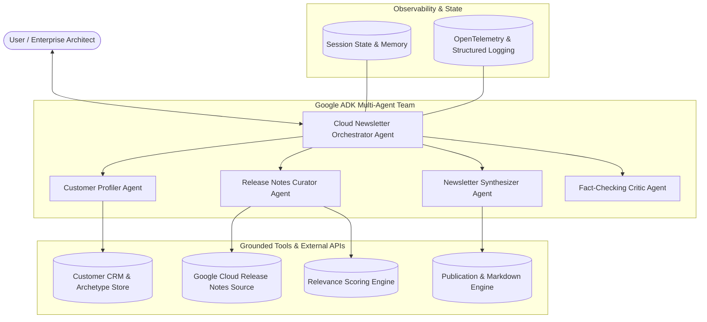

# Google Cloud & Gemini Enterprise Personalized Newsletter Agent

[](https://github.com/dprzek/personalized-cloud-newsletter-agent/actions/workflows/ci.yml)
[](https://www.python.org/downloads/)
[](https://google.github.io/adk/)
[](https://deepmind.google/technologies/gemini/)

An enterprise-grade, multi-agent AI system built with the **Google Agent Development Kit (ADK)** and powered by **Gemini 2.5 Flash**. The agent profiles enterprise customers, curates recent Google Cloud and Gemini Enterprise release notes, evaluates architectural and business impact, and synthesizes tailored, executive-ready engineering digests.

---

## 🏛️ System Architecture

The system utilizes a hierarchical multi-agent orchestrator with specialized domain agents, resilient tool execution, session state management, and OpenTelemetry tracing:



---

## ✨ Key Capabilities

1. **Intelligent Customer Profiling**: Queries enterprise customer profiles (industry, cloud tech stack, compliance constraints, and strategic roadmap priorities) or dynamically learns them during multi-turn interactions.
2. **Grounded Release Notes Ingestion**: Ingests official Google Cloud and Gemini Enterprise release notes with automatic failover to a curated, high-fidelity knowledge base.
3. **Relevance & Impact Scoring**: Algorithmic scoring that aligns release note items with the customer's specific technology stack (e.g. Spanner, GKE, BigQuery, Vertex AI) and strategic priorities.
4. **Tailored Synthesis**: Formats executive summaries, distinguishes between **GA** and **Preview** capabilities, provides concrete *"Why It Matters to [Customer]"* analysis, and outlines actionable next steps.
5. **Quality & Fact-Checking Assurance**: Built-in Critic agent verifies factual alignment against source documentation, eliminating hallucinations.
6. **Enterprise Observability**: End-to-end trace spans and structured JSON logging compatible with Google Cloud Logging and Cloud Trace.

---

## 📂 Repository Structure

```
├── app/
│   ├── __init__.py                 # ADK App definition (app = App(name="app", root_agent=root_agent))
│   ├── agent.py                    # Root Orchestrator Agent & Tool registrations
│   ├── config.py                   # Configuration & environment variables
│   ├── callbacks.py                # Session state initialization & telemetry callbacks
│   ├── memory/
│   │   ├── __init__.py
│   │   └── state_manager.py        # Pydantic schemas & state models
│   ├── observability/
│   │   ├── __init__.py
│   │   └── tracer.py               # Structured logging & trace span context manager
│   ├── sub_agents/
│   │   ├── __init__.py
│   │   ├── profiler.py             # Customer Profiler sub-agent
│   │   ├── curator.py              # Release Notes Curator sub-agent
│   │   ├── synthesizer.py          # Newsletter Synthesizer sub-agent
│   │   └── critic.py               # Fact-Checking & Quality Critic sub-agent
│   └── tools/
│       ├── __init__.py
│       ├── customer_crm.py         # CRM lookup & profile update tool
│       ├── release_notes.py        # Cloud release notes fetcher & parser
│       ├── relevance_ranker.py     # Relevance scoring & impact reasoning
│       └── publisher.py            # Newsletter markdown formatter
├── tests/
│   ├── __init__.py
│   ├── test_agents.py              # Agent structure & tool registration tests
│   ├── test_state.py               # Pydantic schemas & callback state tests
│   ├── test_tools.py               # CRM, Parser, Ranker, and Publisher tests
│   └── eval/
│       ├── evalset.json            # Multi-turn evaluation dataset & rubrics
│       └── run_eval.py             # Automated ADK evaluation runner
├── .github/
│   └── workflows/
│       └── ci.yml                  # GitHub Actions CI workflow (lint, test, eval)
├── Dockerfile                      # Production container image for Cloud Run
├── cloudbuild.yaml                 # Google Cloud Build deployment pipeline
├── pyproject.toml                  # Python project metadata & dependencies
├── requirements.txt                # Pinned requirements
└── README.md                       # Project documentation
```

---

## 🚀 Quickstart & Local Development

### 1. Prerequisites
- Python 3.11 or higher
- `uv` (recommended) or `pip`
- Google Cloud Project with Vertex AI API enabled

### 2. Installation
Clone the repository and install dependencies:

```bash
git clone https://github.com/dprzek/personalized-cloud-newsletter-agent.git
cd personalized-cloud-newsletter-agent

# Using uv
uv sync

# Or using pip
pip install -r requirements.txt
```

### 3. Environment Configuration
Copy `.env.example` to `.env` and set your Google Cloud project ID:

```bash
cp .env.example .env
```

Edit `.env`:
```env
GOOGLE_CLOUD_PROJECT=your-project-id
GOOGLE_CLOUD_LOCATION=global
GEMINI_MODEL=gemini-2.5-flash
LOG_LEVEL=INFO
```

### 4. Running the Agent Locally
You can run the ADK web interface or interact via the command line:

```bash
# Using agents-cli
agents run .

# Or running the FastAPI/Uvicorn server
uv run uvicorn app:app --host 0.0.0.0 --port 8080
```

---

## 🧪 Testing & ADK Evaluation

### Run Unit Tests
Run the comprehensive unit test suite:

```bash
uv run pytest tests/ -v
```

### Run ADK Multi-Turn Benchmark Evaluation
Execute the evaluation runner to validate tool trajectories, persona adaptation, and rubric criteria:

```bash
uv run python tests/eval/run_eval.py
```

**Evaluation Test Cases:**
- `eval-001-fintech-happy-path`: Financial Services persona & compliance prioritization.
- `eval-002-media-multimodal-path`: Media streaming persona & video/multimodal model filtering.
- `eval-003-disambiguation-turn`: Ambiguous request handling & customer disambiguation.
- `eval-004-dynamic-customer-update`: Dynamic profile registration & custom priority handling.

---

## 🚢 Deployment to Google Cloud

### Cloud Run Deployment
Deploy the containerized agent directly to Google Cloud Run:

```bash
# Submit build via Cloud Build
gcloud builds submit --config=cloudbuild.yaml

# Or deploy directly
gcloud run deploy cloud-newsletter-agent \
    --source . \
    --region us-central1 \
    --platform managed \
    --allow-unauthenticated \
    --set-env-vars GOOGLE_CLOUD_PROJECT=your-project-id
```

---

## 📄 License
Apache License 2.0.
